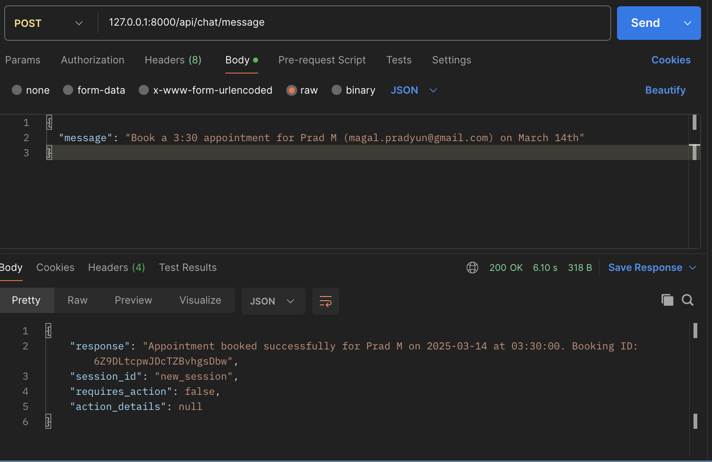
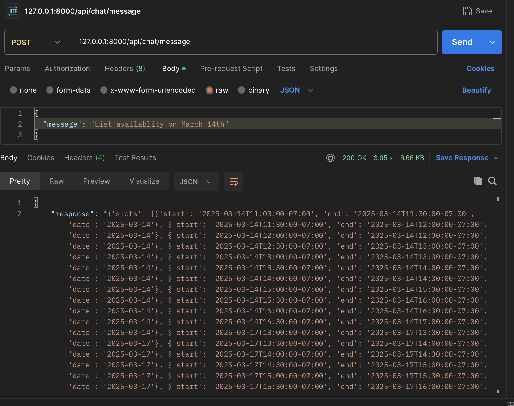

# Cal.com Chatbot API

A FastAPI application that provides a chatbot interface for booking and managing Cal.com events using OpenAI's function calling capabilities. 

* I decided to keep it modular and as thorough as possible, also did not use Langchain as I figured it would be too "Hard coded"  *


## Key Features

- **List Available Slots**: Check available time slots for meetings
- **Book Meetings**: Schedule meetings with intelligent event type selection
- **Auto-Booking**: Automatically books appointments when availability is confirmed
- **Natural Language Processing**: Uses LLM to parse dates and times from natural language

## Listing Available Slots

To list available slots for a specific date:

```bash
curl -X GET "http://localhost:8000/api/calcom/slots?event_type_id=2009270&date=2025-03-12"
```

This will return a list of available time slots for the specified date.

## Booking a Meeting

To book a meeting:

```bash
curl -X POST "http://localhost:8000/api/calcom/bookings" \
  -H "Content-Type: application/json" \
  -d '{
    "event_type_id": 2009270,
    "start_time": "2025-03-12T14:30:00-07:00",
    "end_time": "2025-03-12T15:00:00-07:00",
    "title": "Project Discussion",
    "description": "Meeting to discuss the project",
    "attendees": [
      {
        "email": "john.doe@example.com",
        "name": "John Doe",
        "timezone": "America/Los_Angeles"
      }
    ]
  }'
```

## Using the Chatbot Interface

You can use the chatbot interface to book meetings through various methods:

### Using cURL

```bash
curl -X POST "http://localhost:8000/api/chat/message" \
  -H "Content-Type: application/json" \
  -d '{
    "message": "Book a 30-minute meeting on March 12th at 2:30pm with John Doe (john.doe@example.com) for a project discussion."
  }'
```

### Using Postman

1. Create a new POST request to `http://localhost:8000/api/chat/message`
2. Set the Content-Type header to `application/json`
3. In the request body, use the following JSON:
   ```json
   {
     "message": "Book a 30-minute meeting on March 14th at 2:30pm with Prad M (prad@praddesigns.com) for a project discussion."
   }
   ```
4. Send the request

**Note:** The `session_id` parameter is optional and can be omitted. The system will automatically create a new session if one is not provided.

The chatbot will:
1. Check for available slots on the requested date
2. Select an appropriate event type based on the requested duration
3. Book the meeting automatically if the time is available

## Installation and Setup

1. Install dependencies:
```bash
pip install -r requirements.txt
```

2. Create a `.env` file with your API keys:
```
OPEN_AI_KEY=your_openai_api_key
CAL_KEY=your_calcom_api_key
```

3. Start the server:
```bash
uvicorn app.main:app --reload
```

## Direct Booking Script

For direct booking without using the API, you can use the `book_appointment.py` script:

```bash
python book_appointment.py
```

This script:
- Parses available slots from a previous availability check
- Finds the requested time slot (2:30 PM on March 14th)
- Books the appointment directly using the Cal.com service

## Screenshots

### Successful Booking


### Booking Session


### Listing Events

